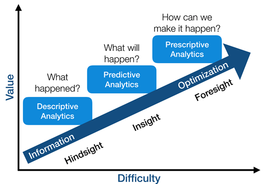

# Predictive Analytics for Optimizing Business Growth (Customer Segmentation and Consumer Behavior Prediction)

## Problem Statement

In this project, I provide data-based insights into the consumer behaviors and make predictions on their future behaviors in order to help an online retailer optimize their business growth. The customer behaviors are for example their retention rate, next purchase day and more.

As supposed to traditional data analysis in marketing (descriptive analytics), predictive analytics involves modeling, data mining and machine learning algorithms to predict and forecast what will happen in the future. In the first two sections of the project, I define some Key Performance Metrics (KPIs) that represent the company's business goal and segment the customers based on the KPIs. I then use predictive analytics to predict the behaviors of each customer groups.

Source: https://www.educba.com/data-analytics-vs-predictive-analytics/

## About this Repository

### Data
The data is from an online retailer and it contains information about all sales made during an eight month period. The columns in this data are the following.
- InvoiceNo
- StockCode
- Description
- Quantity
- InvoiceDate
- UnitPrice
- CustomerID
- Country

Source: https://www.kaggle.com/vijayuv/onlineretail

## Executive Summary

### `01_Metrics.ipynb`
This notebook was intended help the business track and analyze their growth. In order to do so, I defined some metrics that best capture the company's core value that their product delivers to the customers.

According to Sean Ellis, CEO of Growth Hackers, the single metric that best captures the core value value is called **The North Star Metric**. For this online retailer, the north start metric was their Monthly Revenue. I also defined some other KPIs that would help the retailer track their growth--such as monthly active customers, monthly order count, average revenue per order, new customer ratio over time, monthly retention rate and more.

stretch goal
--> dashboarding these metrics, building pipeline

### `02_Customer_Segmentation.ipynb`
This part of the project is to help the business understand the value of each customers. I gave each customers an overall RFM (Recency, Frequency, and Monetary Value) score. I then executed clustering analysis to segment the customers based on the score into three groups-low, mid and high value customers.

 By segmenting customers into different groups, the business can execute personalized marketing strategies to different user groups. In this example, I speculated that high value customers need marketing strategies that improve their recency, whereas for low value customers, marketing strategies to increase their frequency will work better. The effectiveness of the new actions can be tested and evaluated by using A/B testing frameworks and market respond modeling, which I cover in [my A/B testing framework and market resonse project](https://github.com/dae-han/AB_Testing_Framework_and_Market_Response).

### `03_Lifetime_Value_Prediction.ipynb`
Lifetime Value (LTV) of a customer is the gross profit margin the customer brought to the company within a set timeframe. Businesses invest in customers in the form of acquisition cost, offline ads, promotions, discounts etc. While the investment can increase the LTV of some customers, there are some customers who have negative LTV and bring down profitability. If we identify the customer from a historical data, the business would have already suffer from the negative margin. This is when predictive analytics using machine learning can add values to the business growth.

In this notebook, I used the data within the first 6 month as the behavioral data and made prediction of the LTV of customers for the next three months. XGBoost Classifier was used. The accuracy score for the model resulted in 85%. This may sound like a high score but considering the baseline model also scored around 85%, we know that the performance of the model is poor and needs an improvement. Upon review of the classification report, I identified that the poor performance may be caused by the unequal distribution of target variable in our behavior dataset.

Next Step

### `04_Churn_Prediction.ipynb`
The works from the previous three notebooks aimed to identify high value customers. With this new information, we can now strategize on who to retain and the personalized marketing tactics. **Retention rate** or **Churn Rate** is one of the most important metrics to track the impact of this effort. In the customer management lifecycle, customer churn refers to a decision made by the customer about ending the business relationship. It is also referred as the loss of clients or customers.

I selected two algorithms to make the prediction--the first one is logistic regression and the next one is XG Boost classifier.

- **Logistic Regression**

Logistic regression provides interpretable outcome. The exponent of feature's coefficient represent the expected change in the target value by the one unit change in the feature. This helps us to know *what are the most critical characteristics that make the customers stay*. The p-value of each features shows the significance of the coefficient value. In this example, this helps us to understand *which characteristics make customers churn or retain*.

The outcome from logistic regression model provided useful insights into the churn rate. I identified that type of internet services and the customer's contract type had an impact on whether the customer retain or churn. If the customer used Fiber Optic's internet service, they were 2.9 times as likely to churn than customers with different internet service providers. If the customer was contracted on month to month basis, they were 2 times more likely to churn than customers with different contract types such as yearly or bi-yearly.

- **XG Boost Classifier**

XG Boost Classifier scored 82% accuracy rate. Upon the review of the classification report, the model performs most poorly on predicting the customers who will churn. Out of 100 customers who will churn, our model can predict 53 customer's behavior correctly (Recall for positive label). We can improve the model's performance by
  - Adding more data (we have around 2k rows for this example)
  - Adding more features
  - More feature engineering
  - Trying other models
  - Hyper-parameter tuning

### `05_Next_Purchase_Day_Prediction.ipynb`
Predictive analytics in business helps us treat the customers in a way they deserve before they expect that (e.g. LTV prediction) and act before something bad happens (e.g. churn). Knowing the next purchase day of a customer helps us do these. If a customer is expected to make a purchase, no promotional offer is needed because the customer will make a purchase anyways. If a customer is not expected to make any purchase, we can nudge the customer with inbound marketing.

I select the following features as my initial feature candidates for the next purchase day prediction.
- RFM scores & clusters
- Days between the last three purchases
- Mean & standard deviation of the difference between purchases in days

To pick the best model for the prediction, I fitted the features to a list of some of the most commonly used models, which are listed below.

- Support Vector Classifier (SVC)
- Multi Output Classifier
- Gradient Bossting Classifier
- Decision Tree Classifier
- K Neighbors Classifier
- Gaussian Naive Bayes (NB) Calssifier
- Random Forest Classifier
- Logistic Regression
- XGBoost (XBG)

 I picked the one that had the best accuracy score, which was XG Boost Classifier in this example. I then performed GridSearch to find the hyper-parameters.

## Next Step

## Source
